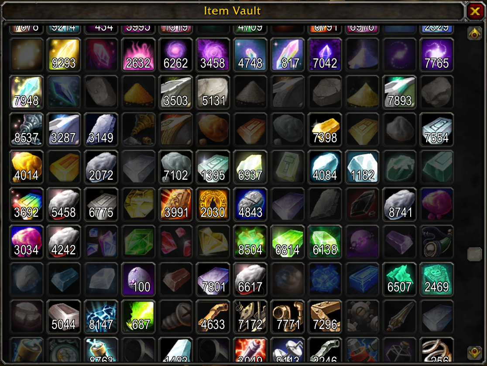
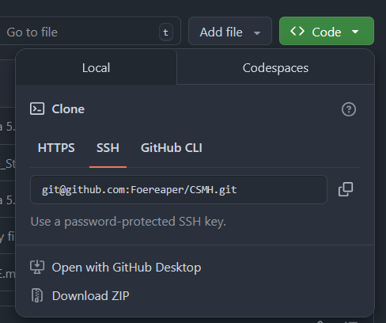

<div align="center">

# Item Vault

This is a client-server module for ALE (AzerothCore) that implements a dedicated item storage to hold many items.

---
</div>

## Full in game GUI using Blizzard art, look and feel.



## List of features

- Holds up to 4 294 967 295 (maximum uint32) items of each type.
- Deposit all command. (`/msda`)
- Deposit specific item command. (`/msd bag slot`)
- Retrieve item per stack with a simple right click on an item.
- Full in game item tooltip support.
- Compatible with HD clients that change textures.

## Upcomig features

- Configurable item limit.
- Improved GUI with search, filtering, categorisation, custom organisation.
- New types of items that can be stored in new dedicated tabs: Gearsets, collectibles, and probably more!
- Better in-game UI with a fully integrated button and ways to easily deposit a single item without commands.

## How to install

> [!NOTE]
> **READ CAREFULLY**
> This module depends on two external libraries. There is no way around it. **You must install them**.
> Dependencies:
> - CSMH by Foereaper
> - ALE by AzerothCore

### Server installation

> [!NOTE]
> This module has been tested with AzerothCore. It might work with TrinityCore using Eluna.
> You are welcome to try using Eluna with TrinityCore, but this module comes without any guarantee for Eluna.

#### 1. Install AzerothCore Lua Engine (ALE)

You can find the detailed installation instructions on the [ALE Github repository](https://github.com/azerothcore/mod-ale?tab=readme-ov-file#ale---azerothcore-lua-engine).
If you are encountering issues while installing ALE, please ask for support on the [AzerothCore Discord server](https://discord.gg/gkt4y2x), in the `#ac-lua-engine` channel. We cannot provide direct support for pure ALE problems.

#### 2. Install CSMH server component

Since we do not want to bundle and redistribute CSMH ourselves for multiple reasons, we will guide you through the installation of both components.

1 - Go to the [CSMH Github repository](https://github.com/Foereaper/CSMH).
2 - Download the ZIP available when clicking on `<> Code` at the top right corner of the screen.

3 - Extract the ZIP wherever you want.
4 - Copy the `Server` folder to your `lua_scripts` directory within your ALE installation. We **strongly** suggest renaming it to `SMH` for `Server Message Handler`.

#### 3. Install Item Vault

We provide two distinct ways to install Item Vault.

**Git repository mirror**

> [!IMPORTANT]
> This requires using `Git` on Windows.
> If you do not know what that means, you should move on to the next section.

We provide an always stable, read-only, [mirror repository](https://github.com/ShatteredDawn/item-vault-server-mirror) of the server part.

Within your `lua_scripts` folder, run:
```sh
git clone git@github.com:ShatteredDawn/item-vault-server-mirror.git item-vault
```
This will create a local, read-only, of the server part and nothing else.
Whenever a new stable version is released, this mirror is automatically updated.
This allows you to simply run:
```sh
git pull
```
Within your copy to update your server.

**ZIP Archive**

Every time we deploy a new release, a ZIP archive is created and attached as a downloadable artifact of the main repository, **not the mirror**. It **only contains the server files**.
It is available in the release section. The file is always called `item-vault-server.zip`.
You can download this zip and simply extract it within your `lua_scripts` folder.
The downside of this method is that you will need to manually download each version.

### Client installation

> [!NOTE]
> This module has been tested with the 3.3.5a client (regular and HD).

#### 1. Install CSMH client component

Since we do not want to bundle and redistribute CSMH ourselves for multiple reasons, we will guide you through the installation of both components.

1 - Go to the [CSMH Github repository](https://github.com/Foereaper/CSMH).
2 - Download the ZIP available when clicking on `<> Code` at the top right corner of the screen.

3 - Extract the ZIP wherever you want.
4 - Copy the `Client` folder to your `interface\addons` directory within your game client installation. The addon **must** be named `CMH` for `Client Message Handler`, otherwise our addon will complain about a missing dependency.

#### 3. Install Item Vault

We provide two distinct ways to install Item Vault.

**Git repository mirror**

> [!IMPORTANT]
> This requires using `Git` on Windows.
> If you do not know what that means, you should move on to the next section.

We provide an always stable, read-only, [mirror repository](https://github.com/ShatteredDawn/item-vault-client-mirror) of the client addon.

Within your `interface\addons` folder, run:
```sh
git clone git@github.com:ShatteredDawn/item-vault-client-mirror.git item-vault
```
This will create a local, read-only, of the client addon and nothing else.
Whenever a new stable version is released, this mirror is automatically updated.
This allows you to simply run:
```sh
git pull
```
Within your copy to update your client addon.

**ZIP Archive (Easiest)**

Every time we deploy a new release, a ZIP archive is created and attached as a downloadable artifact of the main repository, **not the mirror**. It **only contains the client addons files**.
It is available in the release section. The file is always called `ItemVault_Client.zip`.
You can download this zip and simply extract it within your `interface\addons` folder.
The downside of this method is that you will need to manually download each version.

## Backing up your data

> [!IMPORTANT]
> **Always backup your data.**
> Even though we are professional developers and test our software thoroughly, we remain human.
> Remember that you should always maintain a backup of your item vault to avoid permanent data loss.

Item Vault uses a dedicated MySQL database called `item_vault`. It contains a single table called `storage`.
We recommend using a Cloud integrated backup (Scaleway Glacier Storage is what we use), but you can use a simple local system.

Below is a provided BASH (Linux) script allowing you to automatically backup your data.
We recommend adding this script as a periodic CRON job. On our end, we do hourly backups of all data, feel free to tune this interval as you see fit.

> [!NOTE]
> Requirements:
> - `mysql-client`
> - `gzip`

> [!IMPORTANT]
> You **MUST** rename all placeholders (`<YOUR_XXX>`) with the correct values before running this script.

```bash
#!/usr/bin/env bash

set -euo pipefail

LOG_FILE="<YOUR_LOG_FILE_PATH>"
echo "=== Backup started at $(date) ===" >> "${LOG_FILE}"

# Current date in YYYY-MM-DD-HHMMSS format for unique backup filenames
DATE=$(date +%F-%H-%M-%S)
YEAR=$(date +%Y)
MONTH=$(date +%m)
DAY=$(date +%d)
TIME=$(date +%H-%M-%S)
KEY_PREFIX="acore"

# Backup directory on the host
BACKUP_DIR="<YOUR_BACKUP_DIRECTORY>"

mkdir -p "${BACKUP_DIR}"

# Database credentials and details
DB_HOST="<YOUR_DB_HOST>"
DB_USER="<YOUR_DB_USER>"
DB_PASSWORD="<YOUR_DB_PASSWORD>"
declare -a DATABASES_TO_BACKUP=("item_vault")

for db_name in "${DATABASES_TO_BACKUP[@]}"
do
  # Backup filename
  BACKUP_FILENAME="${BACKUP_DIR}/${db_name}-${DATE}.sql"
  echo "Dumping ${db_name} to ${BACKUP_FILENAME}..." >> "${LOG_FILE}"

  # Run mysqldump within a new Docker container
  mysqldump -h "${DB_HOST}" -u "${DB_USER}" -p"${DB_PASSWORD}" "${db_name}" > "${BACKUP_FILENAME}"

  # Compress the backup file
  echo "Compressing..." >> "${LOG_FILE}"
  gzip "${BACKUP_FILENAME}"

  echo "${db_name} backed up successfully." >> "${LOG_FILE}"

done
echo "=== Backup completed at $(date) ===" >> "${LOG_FILE}"
```
